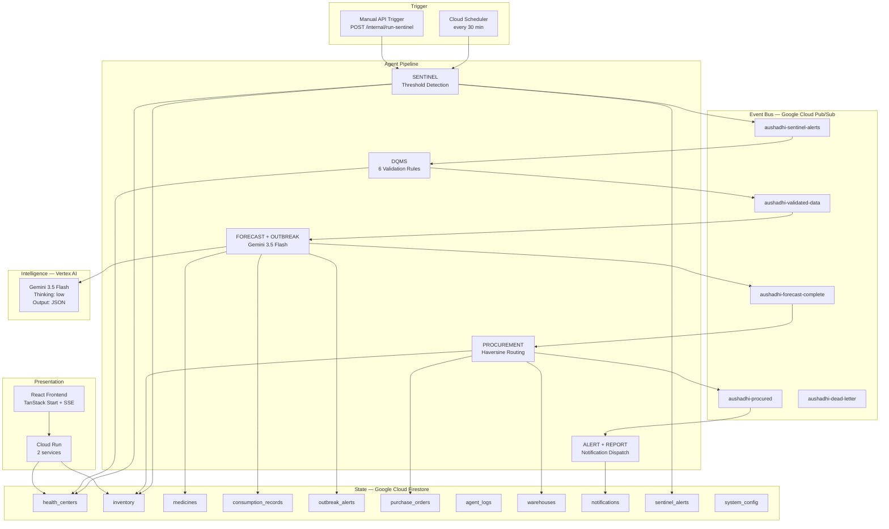
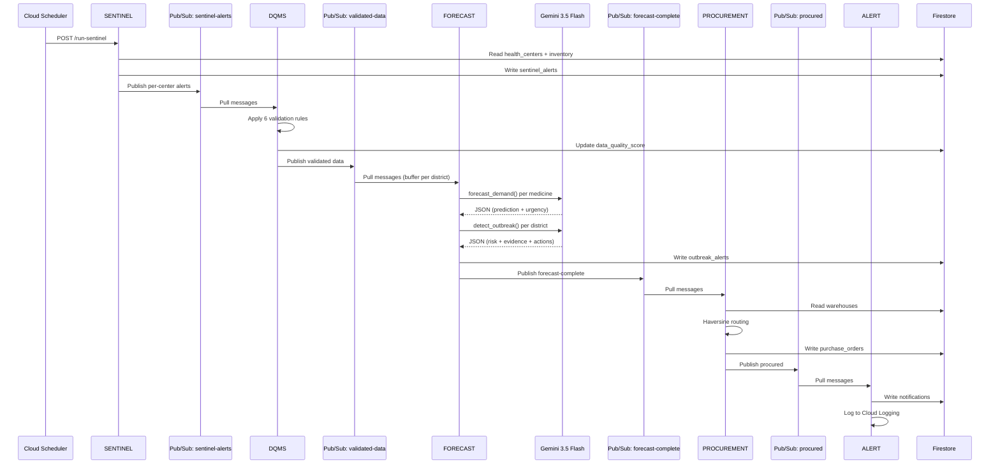

<](https://aushadhi-frontend-230802283586.us-central1.run.app)
[](https://youtu.be/WIZl58Czcl0)
[](#gemini--vertex-ai-implementation)
[](#deployment-architecture)

| | |
|---|---|
| **Hackathon** | [Google All Things Agentic Hackathon](https://googleai.devpost.com/) |
| **Track** | **The Taskmaster** — Complete a Workflow, Not Just a Chatbot |
| **Live App** | [aushadhi-frontend-230802283586.us-central1.run.app](https://aushadhi-frontend-230802283586.us-central1.run.app) |
| **Demo** | [youtu.be/WIZl58Czcl0](https://youtu.be/WIZl58Czcl0) |

---

`5 Agents` · `8 Health Centers` · `10 Medicines` · `4 Pub/Sub Stages` · `Gemini 3.5 Flash` · `Vertex AI` · `Cloud Run` · `Firestore`

</div>

---

## Observe → Validate → Reason → Detect → Act → Notify

```
Cloud Scheduler (every 30 min)
        │
        ▼
  ┌─────────────┐    Pub/Sub     ┌──────────┐    Pub/Sub     ┌───────────────────┐
  │  SENTINEL   │ ─────────────▶ │   DQMS   │ ─────────────▶ │ FORECAST+OUTBREAK │
  │  threshold  │  sentinel-     │  6 rules │  validated-    │  Gemini 3.5 Flash │
  │  detection  │  alerts        │  quality  │  data          │  demand + disease │
  └─────────────┘                │  scoring  │                └───────┬───────────┘
                                 └──────────┘                        │
                                                          forecast-complete
                                                                     │
                                                                     ▼
                                              ┌──────────────┐    Pub/Sub     ┌─────────┐
                                              │ PROCUREMENT  │ ─────────────▶ │  ALERT  │
                                              │  haversine   │  procured      │  notify │
                                              │  routing +   │                │  log    │
                                              │  PO assembly │                └─────────┘
                                              └──────────────┘
```

---

## The Problem

### Medicine Supply

In rural India, medicine supply chains operate on delayed information. A health worker records consumption in a register. A clerk types it. A district officer reads a PDF weeks later. By then, the child with dehydration has already been turned away.

An estimated **40% of rural health centers** experience medicine stockouts every month — not because medicine doesn't exist, but because **the system knows too late**.

### Disease Surveillance

Traditional disease surveillance depends on patient reporting: a doctor files a case → the district compiles → the state investigates. But medicine consumption changes *before* formal reporting catches up.

```
ORS consumption     ↑ 3.8×
Zinc consumption    ↑ 3.6×        Multiple health centers
IV Saline consumption ↑ 3.7×      Temporal + geographic clustering
                                   Post-flood monsoon context
                    ↓
        Potential outbreak signal
```

> **The central innovation is not inventory management.**
> It is using medicine-consumption signatures as an early operational signal for emerging disease outbreaks — then connecting that intelligence directly to supply-chain action.

---

## BYOF — Bring Your Own Friction

The builder is from **Mandapeta, East Godavari, Andhra Pradesh** — the district this system monitors. This project was not selected because healthcare sounded like a good hackathon category. It came from observing the real consequences of medicine availability and healthcare-system friction around PHC-level care in the Godavari delta.

---

## The Solution

AUSHADHI is an **autonomous, event-driven multi-agent system** that continuously monitors medicine inventory across rural health centers.

**Traditional workflow:**
```
Detect → Report → Wait → Approve → Act   (days to weeks)
```

**AUSHADHI:**
```
Observe → Validate → Reason → Detect → Act → Notify   (seconds)
```

After the initial trigger, downstream execution proceeds through all five agents without manual orchestration of each step. Each agent consumes an event, performs its bounded work, mutates operational state in Firestore, and publishes the next event.

---

## The 5-Agent System

| Agent | Responsibility | Input | Processing | Output | Technology |
|-------|---------------|-------|------------|--------|------------|
| **SENTINEL** | Inventory monitoring | All health centers from Firestore | Computes `stock% = current_stock / max_capacity × 100`. Classifies: CRITICAL (<15%), LOW (<30%), MONITOR (<50%), OK (≥50%) | Sentinel alerts + Pub/Sub messages per alerting center | Python thresholds, Firestore reads/writes |
| **DQMS** | Data quality validation | Sentinel alert messages via Pub/Sub | 6 deterministic rules: negative stock, impossible consumption, stale data (48h+), anomaly detection (>5× avg), duplicate check, missing fields. Quality scores each center | Validated + scored records forwarded; rejected records logged | Rule engine, Firestore duplicate queries |
| **FORECAST** | Demand prediction + Outbreak detection | Validated data via Pub/Sub | **Gemini Call 1**: Per-medicine demand forecast (7/30-day prediction, stockout horizon, reorder quantity). **Gemini Call 2**: District-wide outbreak analysis across all centers' anomalies simultaneously | Forecast results + outbreak alerts (if detected) + Pub/Sub | Gemini 3.5 Flash, Vertex AI, structured JSON |
| **PROCUREMENT** | Purchase order generation | Forecast results via Pub/Sub | Haversine nearest-warehouse routing (60 km/h + 2h loading). Batches line items per warehouse. Calculates costs. Links outbreak alerts | Purchase orders persisted to Firestore + Pub/Sub | Haversine library, Firestore writes |
| **ALERT** | Notification dispatch | Procurement results via Pub/Sub | Renders STOCKOUT_ALERT (to Medical Officer) and OUTBREAK_ALERT (to District Health Officer, once per outbreak). Records to Firestore, logs to Cloud Logging | Notification records persisted | Cloud Logging, Firestore |

---

## Why This Is an Agentic System

This distinction is critical for the Taskmaster track.

**Traditional AI application:**
```
User → Prompt → Model → Answer
```

**AUSHADHI:**
```
Scheduler Trigger
    ↓
Agent 1 (SENTINEL)  →  event  →
Agent 2 (DQMS)      →  event  →
Agent 3 (FORECAST)   →  event  →
Agent 4 (PROCUREMENT) →  event  →
Agent 5 (ALERT)
    ↓
Operational state mutated + Notifications dispatched
```

The agents:
- **Operate asynchronously** — each runs its own Pub/Sub pull loop, decoupled from the others
- **Have specialized responsibilities** — SENTINEL doesn't know about procurement; DQMS doesn't call Gemini
- **Consume events and produce events** — Pub/Sub topics are the sole coupling between agents
- **Mutate system state** — Firestore collections are updated as operational side effects
- **Make operational decisions** — warehouse routing, PO assembly, outbreak classification
- **Continue the workflow without a user manually orchestrating each step**

This is not a chatbot with automation. It is an operational loop.

> **Design note — why only 2 of 5 agents call Gemini:** SENTINEL (threshold math), DQMS (rule validation), PROCUREMENT (haversine routing), and ALERT (template rendering) perform deterministic operations. Sending `stock / capacity × 100` to an LLM would waste tokens and add latency for a calculation Python handles in microseconds. Gemini is reserved for the two tasks that genuinely require reasoning: predicting future demand from historical consumption patterns, and detecting cross-center disease signatures across an entire district. This is intentional — an agentic system should use AI where AI adds value, not everywhere.

---

## Architecture



### Google Cloud Services Used

| Service | Purpose | Evidence |
|---------|---------|----------|
| **Vertex AI** | Gemini 3.5 Flash inference (demand forecasting + outbreak detection) | [`services/gemini_service.py`](backend/services/gemini_service.py) — `genai.Client(vertexai=True)` |
| **Cloud Run** | 2 containerized services (API + Frontend) | Deployed at `aushadhi-api-230802283586.us-central1.run.app` and `aushadhi-frontend-230802283586.us-central1.run.app` |
| **Cloud Firestore** | 11 collections for operational state | [`services/firestore_service.py`](backend/services/firestore_service.py) |
| **Cloud Pub/Sub** | 4 agent-to-agent topics + 1 dead-letter | [`infrastructure/pubsub-topics.sh`](infrastructure/pubsub-topics.sh) |
| **Cloud Scheduler** | Triggers SENTINEL every 30 minutes | Referenced in orchestrator; manual trigger via API |
| **Cloud Logging** | Structured agent logs via stdout | [`utils/logger.py`](backend/utils/logger.py) — structlog → stdout → Cloud Logging |
| **Secret Manager** | Credential management (library included) | `google-cloud-secret-manager` in [`requirements.txt`](backend/requirements.txt) |

---

## End-to-End Workflow

A concrete pipeline execution:

```
T+0s    Cloud Scheduler fires POST /api/v1/internal/run-sentinel
        │
T+1s    SENTINEL scans 8 health centers, reads inventory from Firestore
        │  Computes stock percentages, classifies urgency
        │  Centers with CRITICAL or LOW items → sentinel_alerts collection
        │  Publishes N messages to aushadhi-sentinel-alerts (one per alerting center)
        │
T+3s    DQMS pulls from sentinel-alerts-sub
        │  Validates each center's records against 6 rules
        │  Scores data quality (0.0–1.0 per center)
        │  Flags consumption anomalies (>5× baseline) — preserved, not discarded
        │  Publishes validated records to aushadhi-validated-data
        │
T+5s    FORECAST pulls from validated-data-sub
        │  Buffers centers per district (waits for district_alert_count)
        │  ╔═══════════════════════════════════════════════════════╗
        │  ║ GEMINI CALL 1: forecast_demand() per critical medicine ║
        │  ║   → 7/30-day consumption prediction                    ║
        │  ║   → days until stockout                                ║
        │  ║   → reorder urgency + recommended order quantity       ║
        │  ║   → seasonal adjustment + reasoning                    ║
        │  ╠═══════════════════════════════════════════════════════╣
        │  ║ GEMINI CALL 2: detect_outbreak() per district          ║
        │  ║   → Cross-center consumption pattern analysis          ║
        │  ║   → Disease signature matching (Cholera, Malaria, etc.)║
        │  ║   → Risk level + confidence + evidence                 ║
        │  ║   → Recommended public health actions                  ║
        │  ╚═══════════════════════════════════════════════════════╝
        │  If outbreak detected → outbreak_alerts collection
        │  Publishes all messages to aushadhi-forecast-complete
        │
T+18s   PROCUREMENT pulls from forecast-complete-sub
        │  Filters forecasts with reorder_urgency = CRITICAL or HIGH
        │  For each medicine: find nearest warehouse via Haversine
        │  Batch line items per warehouse → single PO per warehouse
        │  PO persisted to purchase_orders, inventory updated
        │  Links outbreak alerts if applicable
        │  Publishes to aushadhi-procured
        │
T+20s   ALERT pulls from procured-sub
        │  Renders STOCKOUT_ALERT → Medical Officer at affected center
        │  Renders OUTBREAK_ALERT → District Health Officer (once per outbreak)
        │  Records to notifications collection
        │  Logs full notification body to Cloud Logging
        │
T+22s   Pipeline complete. Frontend updates via SSE.
```

### Sequence Diagram



---

## Proof of Autonomous Action

After the initial trigger, the pipeline completes without manual orchestration:

| Step | Agent | Observable Action | Firestore Evidence |
|------|-------|-------------------|--------------------|
| 1 | SENTINEL | Scans 8 health centers | `sentinel_alerts` documents created, `health_centers.status` updated |
| 2 | DQMS | Validates records, flags anomalies | `health_centers.status.data_quality_score` updated |
| 3 | FORECAST | Gemini reasons over consumption | `outbreak_alerts` created with `disease_indicators`, `confidence`, `affected_center_ids` |
| 4 | PROCUREMENT | Generates routed purchase orders | `purchase_orders` created with `po_number`, `warehouse_id`, `line_items`, `total_cost_inr` |
| 5 | ALERT | Dispatches notifications | `notifications` created with rendered `STOCKOUT_ALERT` and `OUTBREAK_ALERT` bodies |

**Agent execution is traced in `agent_logs`** — each agent writes STARTED, COMPLETED, or FAILED entries with `duration_ms`, input summaries, and output summaries.

**Frontend receives real-time updates via SSE** — 7 event types including `agent_step`, `outbreak_detected`, `purchase_order_created`, and `pipeline_complete`.

---

## Outbreak Intelligence

> Medicine consumption can function as an early operational signal for disease surveillance.

### The Demonstrated Scenario

In the demo, the seed data simulates a post-flood monsoon scenario in East Godavari:

```
PHC Razole          → ORS 3.8× baseline    Zinc 3.6×    IV Saline 3.7×
PHC Amalapuram      → ORS 3.5× baseline    Zinc 3.4×    IV Saline 3.3×
PHC Mandapeta       → ORS 2.8× baseline    Zinc 2.6×    IV Saline 2.5×
                      ↓
                    Gemini analysis
                      ↓
        ┌──────────────────────────────────────────────────┐
        │  outbreak_detected: true                          │
        │  risk_level: HIGH                                 │
        │  disease_indicators: ["CHOLERA"]                  │
        │  confidence: 0.88                                 │
        │  geographic_cluster: "Godavari delta mandals"     │
        │  recommended_actions:                             │
        │    1. Activate rapid response team                │
        │    2. Deploy oral rehydration corners              │
        │    3. Water quality testing in affected areas     │
        │    4. Community awareness campaign                 │
        │    5. Pre-position medical supplies               │
        └──────────────────────────────────────────────────┘
```

The system prompt in [`gemini_service.py`](backend/services/gemini_service.py) encodes disease-consumption signatures for **Cholera, Malaria, Influenza, Gastroenteritis, and Dengue** — each with primary/secondary medicine indicators, geographic patterns, and seasonal context for Andhra Pradesh.

> **Important:** This is an AI-generated outbreak-risk signal intended to support human and public-health decision-making. It is not a clinical diagnosis or replacement for official disease surveillance (IDSP). Model confidence is not equivalent to medical certainty.

---

## Data Quality — DQMS

DQMS is not a cosmetic layer. Autonomous systems are only as reliable as the data they consume.

| Rule | Check | Action | Score Impact |
|------|-------|--------|-------------|
| 1 | Negative stock | Error → reject | -0.30 |
| 2 | Consumption > opening stock | Error → reject | -0.40 |
| 3 | No update for 48+ hours | Warning | -0.20 |
| 4 | Consumption > 5× the 7-day average | Warning → **flag as anomaly** | No penalty |
| 5 | Duplicate center+medicine+date | Warning → keep better record | — |
| 6 | Required field missing | Error → reject per field | -0.15 each |

**Rule 4 is a critical design decision:** A consumption spike is exactly the outbreak signal the Forecast Agent exists to read. Anomalous data is **flagged and forwarded**, not penalized or discarded. This means DQMS serves both as a safety layer (rejecting impossible data) and as a feature extractor (tagging consumption anomalies for the intelligence layer).

Records that fail validation are rejected and logged — the Forecast Agent never sees them. Records that survive validation carry their quality scores and anomaly flags forward.

---

## Data Architecture — Firestore

| Collection | Purpose | Key Fields |
|-----------|---------|------------|
| `health_centers` | 8 PHC/CHC facilities with location, officer, catchment population | `id`, `name`, `type`, `district`, `subdistrict`, `location.{lat,lng}`, `status.{data_quality_score, overall_stock_status}` |
| `inventory` | Per-center per-medicine stock levels (keyed as `{center_id}_{medicine_id}`) | `current_stock`, `maximum_capacity`, `stock_percentage`, `urgency`, `daily_consumption_today`, `seven_day_avg_consumption`, `anomaly_flag`, `anomaly_ratio` |
| `medicines` | Global medicine catalog with outbreak indicators | `name`, `category`, `unit`, `unit_cost_inr`, `outbreak_indicators[].{disease, significance}` |
| `consumption_records` | Daily consumption history per center per medicine | `center_id`, `medicine_id`, `report_date`, `daily_consumption`, `is_valid`, `quality_score` |
| `outbreak_alerts` | Gemini-generated outbreak intelligence | `risk_level`, `disease_indicators[]`, `affected_center_ids[]`, `confidence`, `key_evidence[]`, `recommended_actions[]`, `status` |
| `purchase_orders` | Autonomously generated POs | `po_number`, `warehouse_id`, `line_items[]`, `total_cost_inr`, `priority`, `outbreak_linked`, `status` |
| `agent_logs` | Execution trace for all 5 agents | `agent_name`, `action`, `status`, `duration_ms`, `input`, `output` |
| `warehouses` | District medical stores with geo-coordinates and stock | `location.{lat,lng}`, `available_medicines[]` |
| `sentinel_alerts` | Raw threshold breach records | `center_id`, `critical_items[]`, `low_items[]` |
| `notifications` | Rendered alert messages | `type`, `recipient`, `body`, `po_number`, `outbreak_alert_id` |
| `system_config` | Runtime configuration | `main_config` |

---

## Event-Driven Architecture — Pub/Sub

| Topic | Publisher | Subscriber | Content |
|-------|----------|------------|---------|
| `aushadhi-sentinel-alerts` | SENTINEL | DQMS (`sentinel-alerts-sub`) | Per-center alert with critical/low inventory items |
| `aushadhi-validated-data` | DQMS | FORECAST (`validated-data-sub`) | Validated + quality-scored records with anomaly flags |
| `aushadhi-forecast-complete` | FORECAST | PROCUREMENT (`forecast-complete-sub`) | Demand forecasts + outbreak analysis per center |
| `aushadhi-procured` | PROCUREMENT | ALERT (`procured-sub`) | Purchase order details + outbreak linkage |
| `aushadhi-dead-letter` | — | — | Unprocessable messages (topic created, handler is future work) |

**Subscription configuration** (from [`pubsub-topics.sh`](infrastructure/pubsub-topics.sh)):
- Ack deadline: 120 seconds (accommodates Gemini rate limiting + retry backoff)
- Message retention: 1 hour
- Expiration: never

**Why Pub/Sub matters:** It prevents the agents from becoming tightly coupled synchronous function calls. Each agent can fail independently. A failed DQMS validation does not block SENTINEL from processing the next center. A Gemini timeout retries without stalling the procurement agent.

---

## Failure Handling

| Mechanism | Implementation | Evidence |
|-----------|---------------|----------|
| **Exponential backoff with jitter** | Custom `@retry` decorator: 4 attempts, 8s initial delay, 2× backoff, 60s max | [`utils/retry.py`](backend/utils/retry.py) |
| **Retryable error detection** | Pattern matching: 503, UNAVAILABLE, 429, RESOURCE_EXHAUSTED, 500, DEADLINE_EXCEEDED, connection reset | [`utils/retry.py`](backend/utils/retry.py) line 27–38 |
| **Agent-level retry** | BaseAgent wraps `process()` in a 2-attempt, 2s-delay retry on top of service-level retries | [`agents/base_agent.py`](backend/agents/base_agent.py) line 35 |
| **Rate limiting** | Async sliding-window limiter shared across all Gemini calls, sized to quota | [`services/gemini_service.py`](backend/services/gemini_service.py) `_RateLimiter` class |
| **Quota exhaustion detection** | Daily free-tier limit (`PerDay`) raises a fatal error instead of burning retry attempts | [`services/gemini_service.py`](backend/services/gemini_service.py) `GeminiQuotaExhaustedError` |
| **Malformed Gemini response** | `json.JSONDecoder().raw_decode()` extracts first valid JSON object, ignoring trailing junk | [`services/gemini_service.py`](backend/services/gemini_service.py) `_parse()` |
| **Pub/Sub nack on failure** | If `handle_message()` raises, PubSubService nacks the message for redelivery | [`agents/base_agent.py`](backend/agents/base_agent.py) line 111–117 |
| **Buffer sweep timer** | Stale district buffers are flushed every 20s so a lost message doesn't strand the pipeline | [`agents/orchestrator.py`](backend/agents/orchestrator.py) `_sweep_buffers()` |
| **Partial pipeline completion** | Outbreak detection failure does not block procurement — forecasts are published regardless | [`agents/forecast_agent.py`](backend/agents/forecast_agent.py) line 411–421 |
| **Per-center isolation** | A failed Firestore read skips one center, never the entire cycle | [`agents/sentinel_agent.py`](backend/agents/sentinel_agent.py) line 105–114 |
| **Health check with timeouts** | `/health` probes Firestore, Pub/Sub, Gemini with 5s deadline each | [`main.py`](backend/main.py) line 96–169 |

### Current Limitations

- Dead-letter queue topic is created but no consumer processes it yet
- No idempotency token on Pub/Sub messages (duplicate delivery is possible)
- No circuit breaker pattern on Gemini calls
- Agent log writes that fail are swallowed (by design — audit logs don't block operational work)

---

## Gemini / Vertex AI Implementation

Gemini is **not** used as a generic chatbot. It performs bounded reasoning tasks inside a deterministic operational workflow.

| Property | Value | Source |
|----------|-------|--------|
| **Model** | `gemini-3.5-flash` | [`config.py`](backend/config.py) line 38 |
| **SDK** | `google-genai` ≥1.0.0 | [`requirements.txt`](backend/requirements.txt) |
| **Auth** | Vertex AI with Application Default Credentials (`vertexai=True`) | [`gemini_service.py`](backend/services/gemini_service.py) line 392 |
| **Endpoint** | `global` (gemini-3.5-flash is served from the global endpoint only) | [`config.py`](backend/config.py) line 37 |
| **Output format** | `response_mime_type="application/json"` (structured output) | [`gemini_service.py`](backend/services/gemini_service.py) line 433 |
| **Thinking** | `thinking_level="low"` (thinking tokens share `max_output_tokens` budget) | [`gemini_service.py`](backend/services/gemini_service.py) line 434 |
| **Retry** | 4 attempts, 8s initial delay, 2× backoff, 60s max, jitter | [`gemini_service.py`](backend/services/gemini_service.py) line 46 |

### Two Gemini Calls — and Only Two

1. **`detect_outbreak()`** — Epidemiological surveillance. One call per district per cycle. Analyzes consumption anomalies across all centers simultaneously. Returns: `outbreak_detected`, `risk_level`, `disease_indicators`, `confidence`, `key_evidence`, `recommended_actions`. Max output: 8,192 tokens.

2. **`forecast_demand()`** — Demand prediction. One call per critical medicine per center. Takes 14-day consumption history + stats. Returns: `predicted_daily_consumption_next_7_days`, `days_until_stockout_at_current_trend`, `reorder_urgency`, `recommended_order_quantity`. Max output: 4,096 tokens.

Both prompts include seasonal context (monsoon, post-monsoon, winter, summer), district-specific weather context, and disease-signature training data for Andhra Pradesh.

---

## Technical Stack

| Layer | Technology | Purpose |
|-------|-----------|---------|
| **AI Model** | Gemini 3.5 Flash | Demand forecasting + outbreak detection |
| **AI Platform** | Google Vertex AI | Model serving with ADC authentication |
| **AI SDK** | `google-genai` | Structured JSON generation with thinking config |
| **Agent Framework** | Custom Python agents on `BaseAgent` | 5 agents with shared lifecycle, audit logging, Pub/Sub routing, and retry (see [Design Decisions](#design-decisions)) |
| **Backend** | Python 3.11, FastAPI 0.111 | API server + agent orchestration |
| **Validation** | Pydantic 2.7 | Request/response schemas + settings |
| **Infrastructure** | Google Cloud Run (2 services) | Containerized API + Frontend |
| **Database** | Google Cloud Firestore | 11 collections, operational state |
| **Messaging** | Google Cloud Pub/Sub | 4 agent topics + 1 dead-letter |
| **Scheduling** | Google Cloud Scheduler | 30-minute SENTINEL trigger |
| **Logging** | Google Cloud Logging + structlog | Structured JSON logs via stdout |
| **Security** | Google Cloud Secret Manager (library) | Credential management |
| **Real-time** | SSE (sse-starlette) | 7 event types to frontend |
| **Routing** | haversine 2.8 | Nearest-warehouse distance calculation |
| **Retry** | Custom exponential backoff | 503/429/500 handling with jitter |
| **Frontend** | React 19, TypeScript 5.8 | Dashboard + intelligence views |
| **Frontend Framework** | TanStack Start + TanStack Router | File-based routing with SSR |
| **State Management** | TanStack Query + Zustand | Server state + UI state |
| **Styling** | Tailwind CSS 4.2 + shadcn/ui | Design system |
| **Charts** | Recharts | Consumption trend visualization |
| **Maps** | React Leaflet | Health center geographic view |
| **Build** | Bun + Vite | Frontend build toolchain |

---

## Security

### Implemented

| Control | Implementation |
|---------|---------------|
| **API Key authentication** | All endpoints require `X-API-Key` header; validated by `APIKeyMiddleware` |
| **SSE authentication** | Stream endpoint accepts `?api_key=` query parameter |
| **CORS** | Explicit origin whitelist (no wildcard); specific methods and headers |
| **Environment-based secrets** | API keys and credentials via environment variables, never hardcoded |
| **Service account auth** | Vertex AI, Firestore, Pub/Sub authenticate via Application Default Credentials |
| **Health check unauthenticated** | `/health` is excluded from auth (required for Cloud Run probes) |

### Security Roadmap (Not Yet Implemented)

- Workload Identity Federation (replace service account keys)
- IAM least-privilege per Cloud Run service
- Firestore Security Rules (beyond service-account access)
- Input sanitization on consumption report ingestion
- Audit trail for PO approvals
- PII protection for medical officer contact data

---

## Observability

### Implemented

- **Structured logging** — every agent logs `agent_started`, `agent_completed`, `agent_failed` with `duration_ms`
- **Gemini call logging** — model, duration, token counts (prompt, output, thinking), result summary
- **Agent execution trace** — `agent_logs` Firestore collection with STARTED/COMPLETED/FAILED states
- **Pipeline status** — `GET /api/v1/agents/orchestrator-status` returns: running, healthy, messages_handled, in_flight, seconds_since_activity, uptime_seconds
- **SSE heartbeat** — frontend receives pipeline state changes in real time

### Observability Roadmap

- OpenTelemetry distributed traces across agents
- Per-agent latency percentiles
- Gemini cost tracking per pipeline run
- Alert on agent failure rates
- Dashboard for historical pipeline performance

---

## Live Demo

### 🌐 [Live Application →](https://aushadhi-frontend-230802283586.us-central1.run.app)

| Page | What It Shows |
|------|--------------|
| **Dashboard** | Top-level metrics, health center cards with stock status, agent pipeline feed, "Run Pipeline Now" + "Simulate Stockout" buttons |
| **Inventory** | Heatmap of stock percentages per medicine across all centers. Highlights anomaly ratios |
| **Outbreaks** | Outbreak intelligence with confidence rings, risk levels, affected centers, evidence, and recommended actions. Status: Active → Under Response → Resolved |
| **Purchase Orders** | Autonomously generated POs with line items, warehouse routing, distance, cost. Actions: Approve → Dispatch → Deliver |
| **Pipeline** | Live 5-agent execution tracker |
| **Settings** | System configuration and demo triggers |

### 🎬 [Demo Video → youtu.be/WIZl58Czcl0](https://youtu.be/WIZl58Czcl0)

---

## Demo Scenario

The seed data ([`scripts/seed_firestore.py`](scripts/seed_firestore.py)) creates a reproducible scenario:

**Health centers:** 8 facilities across East Godavari and Krishna districts (PHC Razole, PHC Amalapuram, PHC Mandapeta, CHC Ramachandrapuram, PHC Kottapeta, PHC Mummidivaram, PHC Machilipatnam, CHC Gudivada)

**Scenario:** Post-monsoon flooding in the Godavari delta. Three PHCs near the river show synchronized consumption spikes in diarrhea-treatment medicines:

| Center | ORS | Zinc | IV Saline |
|--------|-----|------|-----------|
| PHC Razole | 3.8× baseline | 3.6× | 3.7× |
| PHC Amalapuram | 3.5× baseline | 3.4× | 3.3× |
| PHC Mandapeta | 2.8× baseline | 2.6× | 2.5× |

**Expected result:**
1. SENTINEL detects CRITICAL stock levels
2. DQMS flags the consumption spikes as anomalies (Rule 4: >5× average) but **forwards** them
3. FORECAST calls Gemini: returns **HIGH-risk Cholera** signal with ~88% confidence
4. PROCUREMENT generates emergency purchase orders routed to nearest warehouses
5. ALERT notifies District Health Officer with the outbreak intelligence alert

> This is a **demonstration scenario** using seeded data, not a live epidemiological outbreak.

---

## Performance

In the demonstrated pipeline run:

| Metric | Value |
|--------|-------|
| Health centers scanned | 8 |
| Medicines monitored | 10 per center |
| Pub/Sub stages | 4 |
| Gemini calls per cycle | 1 outbreak detection + N demand forecasts |
| Rate limiter | Sliding window, configurable requests/minute |
| Pipeline completion | Seconds (varies with Gemini response time and rate limiting) |

> Pipeline timing depends on Gemini API response latency and the configured rate limit. The free tier caps at 5 requests/minute; Vertex AI billing removes this cap.

---

## Scalability

```
PHASE 1 — Hackathon          8 health centers, 1 district
                                        ↓
PHASE 2 — District Pilot        87 PHCs across East Godavari
                                        ↓
PHASE 3 — State Scale        1,144 PHCs across Andhra Pradesh
                                        ↓
PHASE 4 — National Scale    160,000+ facilities
```

**Architecture decisions that enable scale:**
- **Stateless agents** — Cloud Run containers can autoscale horizontally
- **Pub/Sub decoupling** — agents process messages independently; no shared state lock
- **Firestore** — serverless, no capacity provisioning
- **District-level buffering** — outbreak detection naturally shards by district
- **Configurable rate limiting** — increase `GEMINI_MAX_REQUESTS_PER_MINUTE` with billing

**Separation of current implementation from future architecture:** Current implementation covers Phase 1. Phases 2–4 require district-level tenancy, regional Cloud Run deployments, BigQuery analytics, and potential Dataflow batch processing.

---

## Competitive Differentiation

| Capability | Manual Workflow | Basic Inventory Software | AUSHADHI |
|-----------|----------------|------------------------|----------|
| Inventory monitoring | Paper registers, delayed | Yes, manual thresholds | Autonomous, every 30 min |
| Data validation | Manual review | Basic checks | 6-rule DQMS with quality scoring |
| Demand forecasting | None | Limited/statistical | Gemini-powered per-medicine prediction |
| Cross-center outbreak signal | None | None | **Core differentiator** |
| Autonomous procurement | None | Manual requisition | Routed PO with cost estimation |
| Event-driven agents | None | None | 5 agents via Pub/Sub |
| Real-time visibility | None | Dashboard only | SSE with 7 event types |

**Key differentiator:** AUSHADHI connects supply-chain intelligence with public-health intelligence in one autonomous workflow. No existing system uses medicine consumption as an outbreak signal *and* connects that signal directly to procurement action.

---

## Why AUSHADHI Is Different

```
Not a chatbot.
Not just an inventory dashboard.
Not just a forecasting model.
Not just an outbreak detector.

It is an autonomous operational loop:

    WATCH  →  VALIDATE  →  PREDICT  →  DETECT  →  PROCURE  →  ALERT
```

---

## Limitations and Responsible AI

- **Outbreak detection produces an intelligence/risk signal**, not a clinical diagnosis. It does not replace epidemiological confirmation by trained public health professionals
- **Model confidence is not equivalent to medical certainty** — an 88% AI confidence score is an operational indicator, not a diagnostic probability
- **Procurement recommendations may require policy approval** before execution in a government health system
- **Demonstration datasets are seeded synthetic data**, not evidence of clinical efficacy or real-world validation
- **Weather context is currently static** — no live weather feed is integrated; seasonal and flood context is hardcoded for the demo period
- **No IDSP/HMIS integration** — the system operates on its own data; government health information system integration is planned
- **Production deployment requires** government integration, data governance, regulatory review, clinical validation, and security hardening

---

## Quick Start

### Prerequisites

- Python 3.11+
- Node.js 20+ / Bun 1.x
- GCP project with Firestore + Pub/Sub enabled
- Application Default Credentials configured:
  ```bash
  gcloud auth application-default login
  gcloud auth application-default set-quota-project YOUR_PROJECT_ID
  ```

### Backend

```bash
cd backend
pip install -r requirements.txt

# Copy and configure environment
cp ../.env.example .env
# Edit .env: set GOOGLE_CLOUD_PROJECT, AUSHADHI_API_KEY

# Create Pub/Sub topics and subscriptions
bash ../infrastructure/pubsub-topics.sh

# Seed Firestore with demo data (East Godavari health centers + cholera scenario)
python3 ../scripts/seed_firestore.py

# Start API server + agent orchestrator (single process)
uvicorn main:app --reload --port 8000
```

### Frontend

```bash
cd frontend
bun install
# Create frontend/.env.local with:
#   VITE_API_BASE_URL=http://localhost:8000
#   VITE_API_KEY=your-aushadhi-api-key

bun run dev
# Open http://localhost:5173
```

### Trigger the Pipeline

```bash
# Run the full 5-agent pipeline
curl -X POST http://localhost:8000/api/v1/internal/run-sentinel \
  -H "X-API-Key: YOUR_AUSHADHI_API_KEY"

# Or trigger the cholera outbreak demo scenario
curl -X POST http://localhost:8000/api/v1/internal/simulate-outbreak \
  -H "X-API-Key: YOUR_AUSHADHI_API_KEY"
```

### Docker

```bash
# Backend
cd backend
docker build -t aushadhi-api .
docker run -p 8000:8000 --env-file ../.env aushadhi-api

# Frontend
cd frontend
docker build -t aushadhi-frontend .
docker run -p 8080:8080 aushadhi-frontend
```

---

## Environment Variables

```bash
# ── GCP ──
GOOGLE_CLOUD_PROJECT=aushadhi-hackathon
GOOGLE_CLOUD_REGION=us-central1
VERTEX_LOCATION=global                      # gemini-3.5-flash requires global endpoint

# ── Gemini ──
GEMINI_MODEL=gemini-3.5-flash
GEMINI_THINKING_LEVEL=low                   # Thinking tokens share max_output_tokens budget
GEMINI_MAX_TOKENS=8192
GEMINI_MAX_REQUESTS_PER_MINUTE=5            # Free tier: 5/min; raise with billing

# ── Auth ──
AUSHADHI_API_KEY=<generated-secret>         # python3 -c "import secrets; print(secrets.token_urlsafe(32))"
GOOGLE_APPLICATION_CREDENTIALS=/path/to/sa-key.json  # Local dev only; Cloud Run uses SA

# ── Firestore ──
FIRESTORE_DATABASE_ID=(default)

# ── Pub/Sub ──
PUBSUB_TOPIC_PREFIX=aushadhi

# ── Agent Config ──
SENTINEL_POLL_INTERVAL_MINUTES=30
CRITICAL_THRESHOLD_PERCENTAGE=15
LOW_THRESHOLD_PERCENTAGE=30
OUTBREAK_DETECTION_WINDOW_DAYS=7

# ── App ──
AGENTS_IN_PROCESS=true                      # false when running multiple API replicas
CORS_ORIGINS=http://localhost:5173,http://localhost:3000

# ── Frontend ──
VITE_API_BASE_URL=http://localhost:8000
VITE_API_KEY=<same-aushadhi-api-key>
```

> ⚠️ **Never commit credentials, service-account keys, API keys, or `.env` files to version control.**

---

## Testing

### Available Test Scripts

| Script | Purpose |
|--------|---------|
| [`scripts/test_gemini_outbreak.py`](scripts/test_gemini_outbreak.py) | End-to-end Gemini outbreak detection test against live API with retry handling |
| [`scripts/seed_firestore.py`](scripts/seed_firestore.py) | Seeds Firestore with demo scenario data |
| [`backend/scripts/test_pipeline_e2e.py`](backend/scripts/test_pipeline_e2e.py) | End-to-end pipeline execution test |
| [`backend/scripts/test_firestore_service.py`](backend/scripts/test_firestore_service.py) | Firestore service integration test |
| [`backend/scripts/test_gemini_service.py`](backend/scripts/test_gemini_service.py) | Gemini service integration test |

### Current Limitation

Automated test coverage is currently limited to integration test scripts rather than a formal test suite with unit tests and CI. A comprehensive test strategy covering unit tests (agent logic, DQMS rules, haversine routing), integration tests (Firestore, Pub/Sub, Gemini), and end-to-end pipeline tests is planned.

---

## Deployment Architecture

```
Developer
    ↓ docker build
Container Image
    ↓ docker push
Google Artifact Registry
    ↓ gcloud run deploy
Cloud Run (2 services)
    ├── aushadhi-api        (port 8000, Python/FastAPI + agent orchestrator)
    └── aushadhi-frontend   (port 8080, Bun/TanStack Start SSR)
    ↓
Firestore ← operational state
Pub/Sub   ← event routing
Vertex AI ← Gemini inference
Cloud Scheduler ← 30-min trigger
Cloud Logging   ← structured logs
```

Deployed services:
- **API**: `https://aushadhi-api-230802283586.us-central1.run.app`
- **Frontend**: `https://aushadhi-frontend-230802283586.us-central1.run.app`

---

## Project Structure

```
aushadhi/
├── backend/
│   ├── agents/
│   │   ├── base_agent.py           # Shared lifecycle, logging, Pub/Sub plumbing
│   │   ├── sentinel_agent.py       # Agent 1: Inventory threshold monitoring
│   │   ├── dqms_agent.py           # Agent 2: Data quality validation (6 rules)
│   │   ├── forecast_agent.py       # Agent 3: Gemini demand forecast + outbreak detection
│   │   ├── procurement_agent.py    # Agent 4: Haversine routing + PO assembly
│   │   ├── alert_agent.py          # Agent 5: Notification dispatch
│   │   └── orchestrator.py         # Pub/Sub subscription routing + buffer management
│   ├── api/
│   │   ├── routes/                 # 11 route modules (health_centers, inventory, outbreaks, etc.)
│   │   ├── middleware/auth.py      # API key authentication
│   │   ├── schemas.py              # Pydantic request/response models
│   │   └── router.py              # Route aggregation
│   ├── models/                     # Pydantic domain models (8 files)
│   ├── services/
│   │   ├── firestore_service.py    # All Firestore operations (11 collections)
│   │   ├── gemini_service.py       # THE two Gemini calls + prompts + rate limiter
│   │   └── pubsub_service.py       # Publish + subscribe with pull loops
│   ├── utils/
│   │   ├── logger.py               # structlog configuration
│   │   └── retry.py                # Exponential backoff with jitter
│   ├── scripts/                    # Integration test scripts
│   ├── main.py                     # FastAPI app + lifespan (agent startup)
│   ├── config.py                   # Pydantic settings from env vars
│   ├── Dockerfile                  # python:3.11-slim
│   └── requirements.txt           # 18 dependencies
├── frontend/
│   ├── src/
│   │   ├── routes/                 # TanStack Router: 7 pages
│   │   ├── components/             # Dashboard, inventory, outbreak, pipeline UI
│   │   ├── hooks/useSSE.ts         # SSE connection with exponential backoff
│   │   ├── api/                    # Axios client + endpoint functions
│   │   ├── store/                  # Zustand state
│   │   └── types/                  # TypeScript interfaces
│   ├── Dockerfile                  # oven/bun:1 multi-stage
│   └── package.json               # Bun + TanStack Start
├── infrastructure/
│   └── pubsub-topics.sh            # Creates 5 topics + 4 subscriptions
├── scripts/
│   ├── seed_firestore.py           # Demo data with cholera scenario
│   ├── test_gemini_outbreak.py     # Live Gemini integration test
│   └── teardown.sh                 # Scale Cloud Run to 0 for cost management
├── docs/
│   ├── AGENTS_SPEC.md              # Agent definitions + exact Gemini prompts
│   ├── DATABASE_SCHEMA.md          # All 11 Firestore collections
│   ├── API_CONTRACTS.md            # HTTP endpoint specifications
│   ├── FRONTEND_SPEC.md            # Frontend screens + component specs
│   ├── PRD.md                      # Product requirements + BYOF narrative
│   └── TECHNICAL_STACK.md          # Dependencies + Cloud Run config
├── DEMO_SCRIPT.md                  # 4-minute YouTube demo script
├── BUILD_ORDER.md                  # 11-day build schedule
└── README.md
```

---

## Design Decisions

| Decision | Rationale |
|----------|-----------|
| **Why Pub/Sub between agents?** | Decouples agents, enables asynchronous execution, and allows independent failure/retry. If DQMS is slow, SENTINEL doesn't block. |
| **Why Cloud Run?** | Stateless containers with autoscaling. Single-process mode (API + agents) for hackathon simplicity; multi-replica mode supported via `AGENTS_IN_PROCESS=false`. |
| **Why Firestore?** | Document-based, serverless, no capacity provisioning. Natural fit for health center records, agent logs, and outbreak alerts. |
| **Why Gemini with structured JSON output?** | Reasoning over cross-center consumption patterns requires an LLM. Structured output (`response_mime_type="application/json"`) ensures parseable responses. `raw_decode()` handles occasional trailing characters. |
| **Why DQMS before Gemini?** | Protects the intelligence layer from impossible data (negative stock, consumption > opening). Anomalies are flagged but forwarded — they're the signal, not noise. |
| **Why district-level buffering?** | Outbreak detection needs cross-center visibility. Analyzing one center alone can never produce a clustering signal. The buffer waits for all centers in a district, then runs one Gemini call. |
| **Why `thinking_level="low"`?** | Thinking tokens share the `max_output_tokens` budget. High thinking silently truncates the JSON response. Low thinking provides enough reasoning without consuming the output budget. |
| **Why Vertex AI, not AI Studio?** | AI Studio free tier caps at 20 requests/day — one sentinel cycle can exhaust this. Vertex AI bills the GCP project directly with no daily cap. |
| **Why a custom agent framework?** | The agents require domain-specific lifecycle management: Pub/Sub pull loops, district-level buffering, rate-limited Gemini access, and Firestore audit logging. A custom `BaseAgent` class provides exactly these capabilities with shared retry, logging, and publish/subscribe plumbing — without framework overhead or abstraction mismatches. |

---

## Market Opportunity

### Users

| Role | Use Case |
|------|----------|
| **District Health Officers** | Receive outbreak intelligence alerts, approve emergency procurement |
| **Medical Officers (PHC/CHC)** | Receive stockout alerts, track pending orders |
| **Procurement Teams** | Review autonomously generated POs, manage warehouse dispatches |
| **Public Health Surveillance** | Monitor consumption-based disease signals |
| **ASHA Workers** *(planned)* | Report consumption via mobile PWA |

### Scale in India

- **160,000+** rural health facilities (Sub-Centres, PHCs, CHCs)
- **87** PHCs in East Godavari district alone
- **1,144** PHCs across Andhra Pradesh
- Current coverage: **8 health centers** (demonstration)

### Potential Integrations (Planned)

- **HMIS** — automated consumption ingestion
- **eAushadhi** — government procurement synchronization
- **IDSP** — outbreak notification interoperability

---

## Future Roadmap

### Near Term

| Feature | Description | Status |
|---------|-------------|--------|
| ASHA Mobile PWA | Offline-first consumption logging with Telugu voice input | Planned |
| HMIS Integration | Automated consumption data ingestion from government systems | Planned |
| Gemma Edge Fallback | Config exists (`USE_GEMMA_FALLBACK`, `GEMMA_MODEL=gemma-2-9b-it`); inference code not yet implemented | Planned |

### Medium Term

| Feature | Description | Status |
|---------|-------------|--------|
| Predictive Epidemic Forecasting | Historical consumption + weather + population density | Planned |
| eAushadhi Integration | Government procurement synchronization | Planned |
| Multilingual Intelligence | Telugu, Hindi, Tamil, Kannada | Planned |
| Supply Chain Anomaly Detection | Detect systematic over/under-reporting | Planned |

### Long Term

| Feature | Description | Status |
|---------|-------------|--------|
| National Surveillance Enhancement | IDSP interoperability | Planned |
| Cold Chain Monitoring | Vaccine temperature tracking | Planned |
| AI Health Worker Assistant | Contextual, stock-aware, local-language support | Planned |

---

## Findings and Learnings

### AI Reliability
Structured model outputs (`response_mime_type="application/json"`) significantly reduce parsing failures, but Gemini occasionally appends characters after the JSON object. `json.JSONDecoder().raw_decode()` handles this gracefully by extracting only the first complete JSON object.

### Event-Driven Systems
Asynchronous systems require careful thinking about message ordering, buffer management, and stale-state handling. The district buffer pattern — waiting for N centers before running outbreak detection — was the most architecturally challenging part. A 20-second sweep timer prevents indefinite blocking when messages are lost.

### Data Quality as a Feature
The DQMS Rule 4 decision — flagging consumption anomalies but *not* penalizing them — was counterintuitive but essential. A consumption spike that looks like bad data to a quality checker is exactly the epidemiological signal the outbreak agent needs. The same data point is simultaneously a quality concern and a feature.

### Healthcare AI
Model confidence must never be confused with clinical certainty. An 88% confidence from Gemini is an operational indicator for a health officer to investigate — not a diagnosis. The disclaimer in the system isn't just liability protection; it reflects genuine epistemological humility about what consumption data can and cannot prove.

### Cloud Deployment
Gemini 3.5 Flash is only served from the `global` Vertex AI endpoint. Regional endpoints (us-central1, etc.) return 404 NOT_FOUND. This was discovered through debugging, not documentation — and cost hours of troubleshooting.

---

## Hackathon Judging Alignment

| Criterion | How AUSHADHI Addresses It | Evidence |
|-----------|--------------------------|----------|
| **Innovation & Operational Utility (40%)** | | |
| Real-world friction | Medicine stockouts + delayed disease surveillance in rural India | BYOF from East Godavari |
| Autonomous execution | 5 agents execute through Pub/Sub without manual step orchestration | [orchestrator.py](backend/agents/orchestrator.py) |
| Multi-step workflow | Observe → Validate → Reason → Detect → Act → Notify | 4 Pub/Sub stages, 5 agents |
| High-value action | Emergency procurement + outbreak intelligence (not just a chatbot response) | Purchase orders + outbreak alerts in Firestore |
| Novel twist | Medicine consumption as disease outbreak signal | [gemini_service.py](backend/services/gemini_service.py) OUTBREAK_SYSTEM_PROMPT |
| **Architectural Discipline (30%)** | | |
| Agent separation | 5 agents, each owns one bounded responsibility | `agents/` directory, 5 files |
| Event-driven | Pub/Sub topics decouple all agents | [pubsub-topics.sh](infrastructure/pubsub-topics.sh), 4 topics + dead-letter |
| State management | 11 Firestore collections with document schemas | [DATABASE_SCHEMA.md](docs/DATABASE_SCHEMA.md) |
| Gemini integration | Structured JSON output, thinking config, rate limiting, retry | [gemini_service.py](backend/services/gemini_service.py) |
| Failure handling | Exponential backoff, nack redelivery, buffer sweep, partial pipeline | [retry.py](backend/utils/retry.py), orchestrator |
| **Demo & Production Readiness (30%)** | | |
| Live application | [Deployed on Cloud Run](https://aushadhi-frontend-230802283586.us-central1.run.app) | 2 Cloud Run services |
| Reproducible setup | git clone → pip install → seed → uvicorn | Quick Start section above |
| Architecture diagram | Mermaid diagrams in README | This document |
| Cloud deployment | Cloud Run + Firestore + Pub/Sub + Vertex AI + Cloud Scheduler | Verified in repository + live app |
| Gemini 3.5 | `gemini-3.5-flash` via Vertex AI | [config.py](backend/config.py) line 38 |

---

## Bonus Contributions

| Category | Item | Status |
|----------|------|--------|
| **Gemini 3.5 Flash** | Core intelligence model for demand forecasting + outbreak detection | ✅ Implemented |
| **Gemma 2** | Configuration exists (`USE_GEMMA_FALLBACK=false`, `GEMMA_MODEL=gemma-2-9b-it`); inference fallback code not yet implemented | ⬜ Configured, not implemented |

---

<div align="center">

---

**AUSHADHI** turns delayed medicine-supply data into autonomous operational intelligence — watching health centers, validating signals, using Gemini to reason across consumption patterns, detecting potential outbreaks, generating procurement actions, and alerting the people who need to act.

*Built for the [All Things Agentic Hackathon](https://googleai.devpost.com/) by Google.*
*From Mandapeta, East Godavari — the district where this problem is personal.*

---

`Google Gemini 3.5 Flash` · `Vertex AI` · `Cloud Run` · `Firestore` · `Pub/Sub` · `Cloud Scheduler`

</div>
]]>
